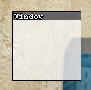

# Port UI
Garry's Mod menu state surface based UI \
Using [render.SetViewPort](https://gmodwiki.com/render.SetViewPort) and [render.SetScissorRect](https://gmodwiki.com/render.SetScissorRect)

## Installation and Usage
1. Download the repository [here](https://github.com/github-is-garbage/port-ui/archive/refs/heads/main.zip)
2. Extract the ZIP file into `garrysmod/addons/port-ui`
3. Add the following line to your `garrysmod/lua/menu/menu.lua` file to load the script:

```lua
RunString(file.Read("addons/port-ui/lua/port-ui/init.lua", "GAME"), "addons/port-ui/lua/port-ui/init.lua")
```

4. Now you can access the `portui` global table and create elements like so:

```lua
local ExampleWindow = portui.Elements.Create("Window")
ExampleWindow:SetPos(10, 10)
ExampleWindow:SetSize(200, 150)
ExampleWindow:SetTitle("I am a Beautiful Window")
```

Result:



> [!TIP]
> You can view documentation for everything in the [docs](./docs/README.md) folder.

> [!IMPORTANT]
> ### Known Issues / Jank
> - Due to this being made with View Ports, Elements rendered with a screen X or Y position off the screen bounds
> will be clipped due to DirectX clipping. This is NOT able to be fixed with `DisableClipping`.
>
> - Due to how the current Rendering and Input systems work, there is no `:IsHovered` function for elements.
> Since there are no Render Targets in menu state, fixing this would require looping all elements multiple times per frame,
> which is very detrimental to performance.
>
> - Text rendering is weird inside Elements because of the View Ports due to how the View Ports mess with aspect ratio.
> This is allegedly due to a lack of `cam.Start` availability in menu state.
> This has been partially remedied by the implementation of the `portui.Elements.Renderer.SwapPortRect()` and `portui.Elements.> Renderer.UnSwapPortRect()` functions.
>
>- The ColorPicker's sub Elements don't have their handles in the correct location on instantiation
